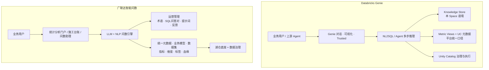
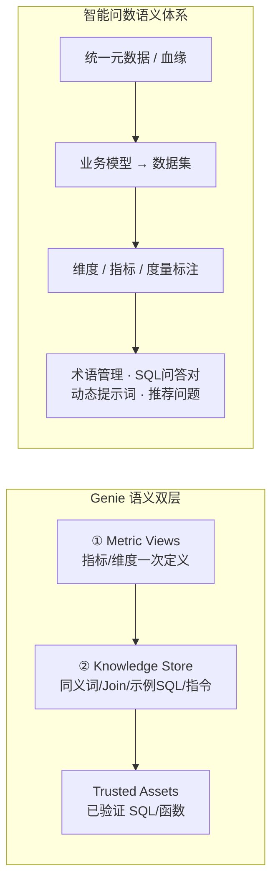

# Genie vs 广联达智能问数 · 语义层对照

> 用途：方案评审、跨部门培训、竞品/对标讲解  
> 编制说明：Genie 侧依据 Databricks Genie Agent（原 Genie Space）公开架构；广联达侧依据《智能问数-产品与方案说明》及产品界面特性标注  
> 版本：V1.0 · 2026-07-31

---

## 1. 一句话对照

| 产品 | 语义层怎么做 |
|------|----------------|
| **Databricks Genie** | **平台统一口径（Metric Views / Unity Catalog）** + **Space 专属知识库（Knowledge Store）**，再由 Agent 做 NL2SQL |
| **广联达智能问数** | **湖仓治理后的统一元数据 / 业务模型 / 指标维度标签** + **运营侧术语·SQL 问答对·提示词**，再由 LLM/NLP 问数引擎落地 |

共同点：都不是「只靠大模型猜表」，而是 **语义资产 + 问数引擎 + 反馈运营**。  
差异点：Genie 把「可复用指标对象」沉得更靠平台；智能问数把「业务模型树 + 认知/分析分流 + 多场景入口」做得更贴中台与行业应用。

---

## 2. 架构对照总图



---

## 3. 语义层结构对照



| 语义能力 | Genie | 广联达智能问数 | 对照结论 |
|----------|-------|----------------|----------|
| **统一指标口径** | Metric Views（平台对象，多端复用） | 数据指标 + 字段口径（统一元数据） | 目标一致；Genie 更强调「平台级可编译指标对象」 |
| **维度/度量分离** | Metric Views：measure 与 dimension 分离定义 | 界面「维度」「指标」语义标注 + 模型字段 | 目标一致；问数侧与业务模型树绑定更强 |
| **业务主题组织** | 按 Space/域挂接相关表与视图 | **业务模型 → 数据集** 树（行业/主题） | 问数的「模型看板」更贴近中台目录体验 |
| **同义词 / 业务黑话** | Knowledge Store 同义词、描述 | **术语管理** + 元数据说明 | 能力对位 |
| **关系 / Join** | KS Join；可继承 UC PK/FK | 模型/数据集结构与治理加工结果 | Genie 在 Agent 侧显式配 Join 更突出 |
| **示例问法 / 标准 SQL** | 示例 SQL、SQL 函数、**Trusted** | **SQL 问答对**、推荐问题、问询范式 | 能力对位；Genie 的 Trusted 标识更产品化 |
| **指令 / 提示** | Space 文本指令、Prompt Matching | **动态提示词**、LLM 管理、问询范式说明 | 能力对位 |
| **元数据探查** | 依赖描述与目录，偏「能生成查询」 | **独立认知类意图**（有哪些模型/指标/口径） | 问数把「先认知再建查询」做得更完整 |
| **权限治理** | Unity Catalog 行/列级随用户生效 | 中台统一权限与数据服务体系（方案层） | 均强调「问数不绕开治理」 |
| **反馈闭环** | 点赞等回流作者调优 KS/示例 | 显隐反馈、历史提问、问答对沉淀 | 能力对位 |

---

## 4. 分层职责对照表

| 层级 | Genie | 广联达智能问数 |
|------|-------|----------------|
| **场景/入口** | Genie Agent 对话；可被上游 Agent 调用 | 统计分析门户、施工台账、应用问数助理 |
| **体验能力** | 多轮对话、图表、Trusted、Agent 模式 | 会话历史、推荐问题、模型看板、NL 输入、多模型切换 |
| **问数引擎** | Compound AI：检索语境 → CoT → SQL | 意图识别 → 语义解析 → NL2SQL / NL2Chart |
| **语义配置** | Metric Views（平台）+ Knowledge Store（Space） | 统一元数据/模型/指标 + 术语/SQL问答对/提示词 |
| **数据底座** | 湖仓 + Unity Catalog | 湖仓底座 + 数据治理 + 数据服务 |

---

## 5. 提问处理路径对照

### 5.1 Genie（偏「一次问清并出数」）

```text
自然语言
  → 解析 + 检索（Metric Views / KS / 示例 / 历史）
  → 优先 Trusted，否则生成 SQL
  → UC 鉴权执行
  → 结果 + 可视化（可标 Trusted）
```

### 5.2 智能问数（显式「认知 / 分析 / 辅助」分流）

```text
自然语言
  → 意图识别
       ├─ 认知类 → 元数据列表 / 口径说明（通常不落明细 SQL）
       ├─ 分析类 → 语义解析（模型/数据集/维度/指标/筛选）→ SQL/图表
       └─ 辅助类 → 引导 / 澄清 / 超范围提示
  → 反馈与运营配置回流
```

**培训话术：**  
Genie 强在「受治理语义对象上的对话分析」；智能问数强在「先帮用户认清能问什么，再做指标分析」，并嵌入多个业务场景入口。

---

## 6. 关键对象名词映射（写方案可直接用）

| Genie 概念 | 广联达智能问数近似概念 | 备注 |
|------------|------------------------|------|
| Genie Space / Agent | 问数助理 / 某一业务域问数空间 | 都是「域内对话容器」 |
| Metric Views | 数据指标 +（部分）语义化数据集定义 | 粒度与产品形态不完全一一对应 |
| Knowledge Store | 术语管理 + 模型/字段描述 + 局部配置 | Space 专属 vs 中台运营配置 |
| Trusted Assets | SQL 问答对（优质沉淀） | 问数可补「可信/已验证」产品表达 |
| Unity Catalog 元数据 | 统一元数据 + 血缘 | 治理目标一致 |
| Example SQL | SQL 问答对 / 推荐问题背后的标准答法 | — |
| Text Instructions | 动态提示词 / 问询范式 | — |
| Synonyms | 术语管理 | — |
| Dashboard 同口径复用 | 统计分析门户等场景共用语义资产 | Genie 与 Dashboard 共用 Metric Views 更强调 |

---

## 7. 优劣势与借鉴建议（产品视角）

### 7.1 Genie 可借鉴点

1. **平台级 Metric Views**：指标一次定义，问数/看板/SQL 共用，减少「各算各的」。  
2. **Trusted 路径产品化**：关键口径命中已验证 SQL 时明确可信标识。  
3. **语义双层**：平台统一 + Space 定制，避免全局被单一场景污染。  
4. **Agent 可编排**：Genie 可作为上游 Agent 的工具，适合多域路由。

### 7.2 智能问数已具备/可强化的差异化

1. **认知类问数独立**：元数据探查与分析问句分流，降低「不会问」门槛。  
2. **业务模型树 + 模型看板**：更贴数据中台资产目录心智。  
3. **多场景落地**：门户 / 台账 / 助理，不只是单一 Chat。  
4. **运营配置体系**：LLM 管理、动态提示词、历史提问、显隐反馈已成闭环雏形。

### 7.3 对内建议（可写入迭代）

| 优先级 | 建议 | 对应 Genie 能力 |
|--------|------|-----------------|
| P0 | 强化「指标口径唯一真相」与跨场景复用 | Metric Views |
| P0 | SQL 问答对增加「已验证/可信」状态与优先命中 | Trusted Assets |
| P1 | 明确「平台语义」与「助理/空间级配置」边界 | 双层语义 |
| P1 | 保持并产品化认知类 vs 分析类分流 | （问数差异化） |
| P2 | 探索问数能力被其他 Agent/应用以工具方式调用 | Genie as Tool |

---

## 8. 培训用 3 分钟讲稿

1. **两边都在做语义层**，不是纯 ChatGPT 查数。  
2. **Genie**：Metric Views 管「怎么算」，Knowledge Store 管「怎么说、怎么举例」。  
3. **智能问数**：业务模型/指标维度管「有什么、怎么算」，术语与 SQL 问答对管「怎么问、怎么答」。  
4. **问数的特色**：先支持「都有哪些指标」这类认知问题，再做分析问数，并嵌入门户与台账。  
5. **下一阶段**：把 Genie 的「可信资产 + 平台统一指标对象」吸收进来，同时守住我们的场景化与认知分流优势。

---

## 9. 附录：一页纸速查表

| 维度 | Genie | 广联达智能问数 |
|------|-------|----------------|
| 语义核心 | Metric Views + Knowledge Store | 统一元数据 + 业务模型 + 指标维度 |
| 配置重心 | 平台对象 + Space 知识 | 中台资产 + 运营配置 |
| 可信机制 | Trusted Assets | SQL 问答对（可增强可信态） |
| 问法类型 | 偏分析对话；Agent 可多步 | 认知 / 分析 / 辅助显式分流 |
| 入口形态 | Chat（可被 Agent 调用） | 门户 + 台账 + 助理 |
| 治理底座 | Unity Catalog | 数据中台治理与权限体系 |

---

*本文仅用于内部方案与培训对齐，Genie 能力以 Databricks 最新文档为准；智能问数能力以现行产品方案与原型为准。*
